<!-- cover -->

# An Aura of Words

### Green Spaces of Lugano

<p class="cover-meta">
SUPSI MAIND-S2 — Make Use of Data · 2026<br/>
<a href="https://jerem-marti.github.io/MAInD-Making_Use_of_Data-2026-Lugano_Parks/">Live visualisation ↗</a>
</p>

<hr class="lens-rule"/>

<!-- /cover -->

## Abstract

**An Aura of Words** is a scrollytelling interface that transforms citizen language — Google Reviews of five Lugano parks — into a visual portrait called an *aura*. By encoding over 3,400 words into six semantic lenses, the project provokes a question: *does this portrait match how you see this park?* It invites both individual reflection and collective debate about how public space is experienced and valued.

## Citizen Call

> Does Lugano's green space data tell the full story?
> Explore the six profiles and see how the parks are perceived by those who visit them.
> Does it ring true from your perspective? What is missing? What would you add?

## Debate

Public parks are officially described through institutional channels: planning documents, maintenance reports, facility inventories. These records tell you what is physically present but they say little about how citizens actually experience, feel about, and assign meaning to those spaces. **An Aura of Words** starts from a different premise: the language citizens use, when writing a review after a park visit, contains a richer and more honest portrait of a place than any official record. The challenge is that this language is vast, unstructured, and dispersed across hundreds of individual reviews. On its own, it is difficult to read at a glance.

The project's central proposition is that this qualitative language can be encoded — systematically transformed into a visual form that is immediately legible — without losing what makes it valuable: its texture, its subjectivity, its contradictions. The result is the *aura*: a colour-weighted portrait of each park built entirely from citizen words.

But encoding is not neutral, and a portrait is not a fact. Once the aura is visible, the interface turns it into a provocation: *"Is this how you see this park?"* This question opens a debate that operates on two levels simultaneously. At the **individual** level, it invites each viewer to test the portrait against their own experience — to agree, to push back, or to notice what is missing. At the **collective** level, it makes visible the fact that different people experience the same park differently. The debate, then, is not about whether parks are good or bad. It is about whose experience counts in how we understand public space, and whether the collective voice of citizens, once made legible, can tell us something that official channels cannot.

## Dataset

### Type of Data

The project uses citizen-generated textual data: written Google Reviews of five public green spaces in Lugano. The dataset consists of natural-language text in multiple languages (primarily Italian, German, English, and French), star ratings, and review dates. All review text was translated into a single working language before lexicon matching, so categorisation operates on a normalised corpus.

Reviews are informal, unstructured, and unprompted — voluntary testimony from people who chose to write after a visit. This distinguishes them from surveys or structured feedback forms. Reviews are not produced to satisfy a reporting requirement; instead they are personal, affective, and opinionated. The project's argument is that this informality is a feature, not a flaw: it is precisely what makes reviews a meaningful portrait of how parks are actually experienced.

### Platforms and Sources

Data was collected from Google Maps (Google Reviews) using a custom Python script built with **Playwright** — a browser automation tool that simulates a real user navigating the page. For each park, the script opened the reviews panel and scrolled to load up to **500 entries**. The script then extracted the written review text, star rating (1–5), date of publication, and reviewer name.

Only reviews containing written text were retained; star-only ratings were excluded as uninformative for language analysis. No keyword filtering or timeframe restrictions were applied — the goal was to capture the full range of how each park is described.

During the process we also explored TikTok and Instagram as supplementary sources, collecting data manually, but these were ultimately not included in the final analysis. The dataset used in the project consists entirely of Google Maps text reviews across the five selected parks.

**Selected parks and corpus volume**

| Park | Reviewed words |
| --- | ---: |
| Parco Ciani | 1,620 |
| Parco Tassino | 856 |
| Parco San Michele | 550 |
| Parco Panoramico Paradiso | 369 |
| Parco Lambertenghi | 65 |
| **Total** | **3,460** |

The five parks differ markedly in popularity and volume, ranging from Parco Ciani (the most reviewed lakefront park) to Parco Lambertenghi (a small neighbourhood pocket with comparatively little written feedback). This volume gradient is itself part of the visualisation: per-park word totals are encoded in the aura's geographic representation on the map.

### Data Categorisation

A category framework was needed to assign each park its own *personality* — a way to simplify the dataset without watering it down.

We started by reading 100 reviews and identifying themes and patterns through exploratory brainstorming. Before the full dataset was available, an initial five-category set was proposed based on reasoning about how people typically describe public spaces:

1. How a place made you feel
2. What it looked / sounded / smelled like
3. What people did there
4. Who was present
5. Complaints and friction

These were provisional, explicitly flagged as needing validation against real review data before being fixed. We fed the partial dataset to Claude to validate the proposed categories; the five semantic categories were validated.

Once the complete dataset (covering five parks and over 3,400 word occurrences) was available, the categories were reconsidered from scratch rather than taken as given. The full corpus was read to identify how reviewers actually structured their descriptions. This pass confirmed that the five initial categories were broadly sound, but revealed a significant gap: reviewers frequently named specific physical features (benches, fountains, playgrounds, paths, parking) in a way that didn't fit neatly into sensory or emotional language. This pattern was frequent and consistent enough across all parks to warrant its own category.

A sixth category, **Infrastructure / Amenities**, was added to capture the concrete physical fabric of each park as described by visitors.

The final categories:

| Category | Hue | What it captures |
| --- | --- | --- |
| Experiential–Emotional | <span class="lens-swatch" data-lens="emotional"></span> Purple `hsl(270, 70%, 70%)` | The inner state of the visitor — how the park made them feel |
| Sensory–Environmental | <span class="lens-swatch" data-lens="sensory"></span> Green `hsl(153, 80%, 70%)` | Perceptual qualities — colour, sound, light, smell, texture |
| Action | <span class="lens-swatch" data-lens="action"></span> Blue `hsl(190, 80%, 70%)` | Activities and behaviours — what people did or came to do |
| Relational Context | <span class="lens-swatch" data-lens="relational"></span> Yellow `hsl(57, 65%, 60%)` | Social identity — who was there, who the park is for |
| Infrastructure–Amenities | <span class="lens-swatch" data-lens="infrastructure"></span> Orange `hsl(33, 90%, 70%)` | Physical features and facilities — benches, fountains, paths, playgrounds |
| Tension / Complaint | <span class="lens-swatch" data-lens="tension"></span> Red `hsl(0, 80%, 70%)` | Negative signals — crowding, neglect, disappointment, friction |

### Filtering Words into Categories

Each review was processed by mapping terms to one of the six semantic categories. Each word occurrence was tagged, counted, and recorded in a structured dataset with fields including: park name, semantic category, term, frequency, context excerpt, and up to seven co-occurring terms per entry (enabling co-occurrence and network analysis).

> **Methodological principle.** If a word or pattern in the corpus didn't fit any category cleanly, it was *flagged* rather than forced. The categories serve as a filter — functional words ("the", "and", "very") are excluded entirely, and only words carrying meaningful descriptive weight are tagged.

The extraction process used a **semantic lexicon**: a manually curated list of terms (single words and short phrases) associated with each of the six categories. For each park's review corpus, every occurrence of every lexicon term was identified using regex word-boundary matching, ensuring that partial matches inside longer words were avoided.

For each matched term, the following was recorded:

- the **term** itself (e.g. *quiet*, *families*, *neglected*),
- the **category** it belongs to,
- its **frequency** — total number of occurrences across all reviews for that park,
- a **context excerpt** — the surrounding text from the review in which each occurrence appeared (typically the full sentence or clause).

This produced a structured dataset with one row per occurrence, so a term appearing 12 times would generate 12 rows, each with its own unique context excerpt. The final output covers five parks and approximately **3,729 row-level word occurrences**.

> **Quality-control caveat.** The lexicon contained both *crowded* and *not crowded*. Because *crowded* is a substring of *not crowded*, both expressions matched the same excerpts. *Not crowded* — clearly a positive sensory observation rather than a complaint — was moved from Tension/Complaint to Sensory–Environmental, and a de-overlapping step was discussed to prevent shorter terms from incorrectly matching inside longer phrases that carry the opposite meaning.

### Contextual Co-occurrence

To convey the full meaning of a review — not just its literal wording — we contextualised each statement within the review itself. This allowed the dataset to capture not just what individual words meant, but what they meant *in relation to each other*.

A script was run row by row over the dataset. Each row represents one occurrence of a lexicon term within a specific review excerpt. For that same excerpt, the script searched for any other lexicon terms that appeared in it. Whenever another term was found, both the term and its category were recorded in paired columns: one column for the co-occurring term and one for its category. The output therefore included up to seven pairs per row:

```
co_occurring_term_1, co_occurring_category_1
co_occurring_term_2, co_occurring_category_2
…
co_occurring_term_7, co_occurring_category_7
```

The limit of seven was not chosen arbitrarily. It was based on the dataset itself: the excerpt with the highest number of co-occurring lexicon terms contained seven such terms.

**Worked example — row 900:**

> *"A very beautiful and pleasant park with a stunning view of the lake. There's also a nice playground for the kids!"*

Terms: *beautiful · nice · stunning · pleasant · view · kids · playground*
Categories: experiential-emotional, experiential-emotional, experiential-emotional, experiential-emotional, sensory-environmental, sensory-environmental, relational-context.

This structure has direct consequences for the visualisation. A term like *magnificent* in one Parco Ciani excerpt was found to co-occur simultaneously with terms from four different categories (experiential-emotional, sensory-environmental twice, and tension-complaint) in a single short passage. This kind of multi-category clustering within a single sentence is what the *aura* blob is designed to render visible: not just which categories dominate overall, but how categories appear together — and what emotional or descriptive combinations are characteristic of each park.

**Coverage.** 78% of the 3,729 rows had at least one co-occurring term, meaning the large majority of word occurrences are connected to at least one other meaningful word in context, rather than appearing in isolation. The co-occurrence data is the structural foundation for both the weighted aura calculation (each category's proportion of all categorised words drives the blob shape) and the future network or word-map visualisations showing which terms cluster together within and across categories.

## Visualisation

The live demo is published at the project's [GitHub Pages site ↗](https://jerem-marti.github.io/MAInD-Making_Use_of_Data-2026-Lugano_Parks/).

### What is shown

The visualisation encodes the proportional distribution of semantic categories within each park's review corpus. Specifically, it shows:

- the proportional weight of each of the six categories across all categorised words per park;
- word-by-word categorisation of a single review (the annotation sequence);
- the aggregate aura of each park — a visual semantic fingerprint;
- comparative review volume across parks;
- geographic location of parks on the Lugano map.

This selection directly serves the debate: by making the emotional and sensory dominance of citizen language visible and legible, the interface creates the conditions for the viewer to agree, challenge, or complicate the portrait they are shown.

### Design Choices and Visual Variables

**Colour.** Each of the six semantic categories is assigned a distinct hue, consistent across the entire interface (see the table in §4.3 for HSL values). Colour is the *primary* encoding variable because it lets readers recognise which category a word belongs to instantly, without reading labels. Colour-coded words make the semantic categorisation system immediate and recognisable.

**Shape and size.** The park aura takes the form of an organic, colour-blended blob. The relative area occupied by each colour represents the proportional weight of that category in the park's reviews. A subtle breathing animation reinforces its character as a living, evolving portrait rather than a fixed chart.

**The single-review annotation sequence.** This sequence walks through a single review word-by-word as the user scrolls. Each meaningful term is highlighted in its category colour and boxed; a running counter at the bottom accumulates category weights in real time, building toward the aura. The viewer watches the portrait being constructed.

**The map.** The map beat reveals the five parks on a map of Lugano, each represented by its aura blob at its geographic location. Clicking a park transitions to its individual view, where the full aura, word breakdown, and contribution prompt are accessible.

## Data Contribution

The data contribution flow is designed to collect *small data* on the aspects of a park that citizens value the most. An additional layer reveals how a viewer's own comments would be processed to extract the words that build a park's aura — exposing the inner workings of the encoding pipeline so that contributors can see, in their own contribution, the same logic that produced the existing portraits.

## Interface Exploration

The five active beats below trace the scrollytelling sequence end-to-end.

<figure class="gallery-fig">
  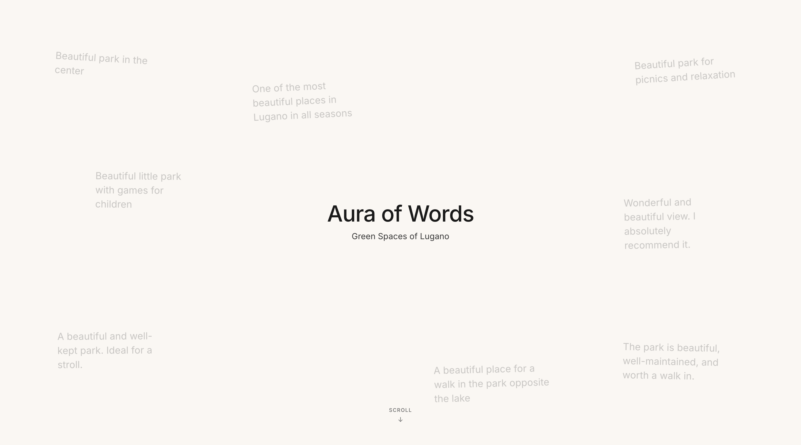
  <figcaption><strong>Beat 01 — Opening.</strong> Drifting fragments from the review corpus introduce the premise: this project listens to citizens.</figcaption>
</figure>

<figure class="gallery-fig">
  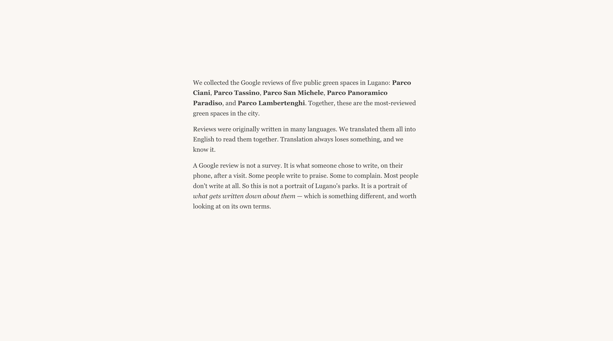
  <figcaption><strong>Beat 02 — Method.</strong> The encoding pipeline is introduced: from raw review text, through the six-lens lexicon, to the aura.</figcaption>
</figure>

<figure class="gallery-fig">
  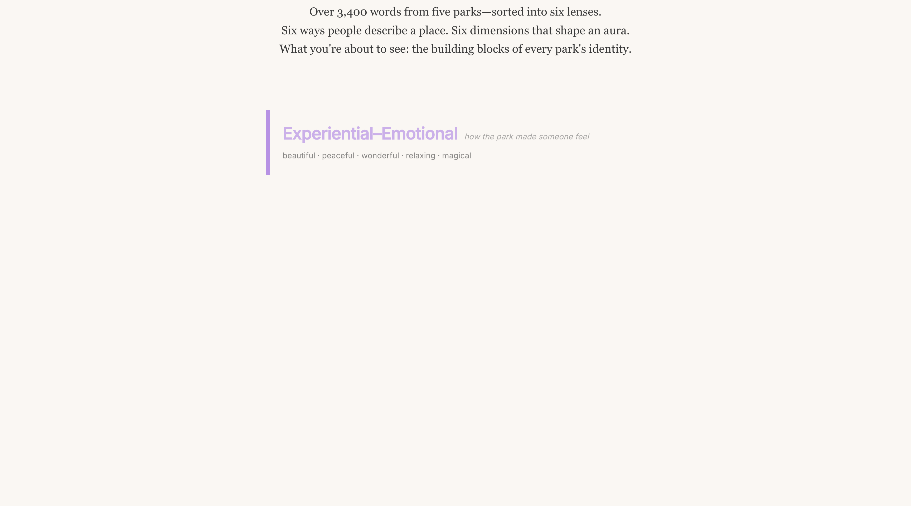
  <figcaption><strong>Beat 04 — Lenses (overview).</strong> All six categories laid out side-by-side, each with its proportion across the corpus.</figcaption>
</figure>

<figure class="gallery-fig">
  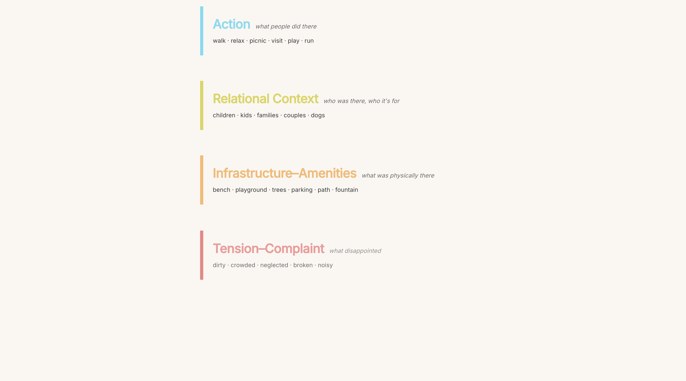
  <figcaption><strong>Beat 04 — Lenses (detail).</strong> A close-up on one lens. The Experiential–Emotional category is the dominant register across most parks.</figcaption>
</figure>

<figure class="gallery-fig">
  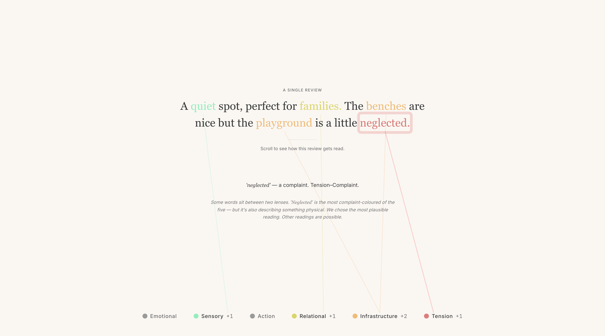
  <figcaption><strong>Beat 05 — Worked example (in progress).</strong> A single review is annotated word-by-word; the running counter builds the aura in real time.</figcaption>
</figure>

<figure class="gallery-fig">
  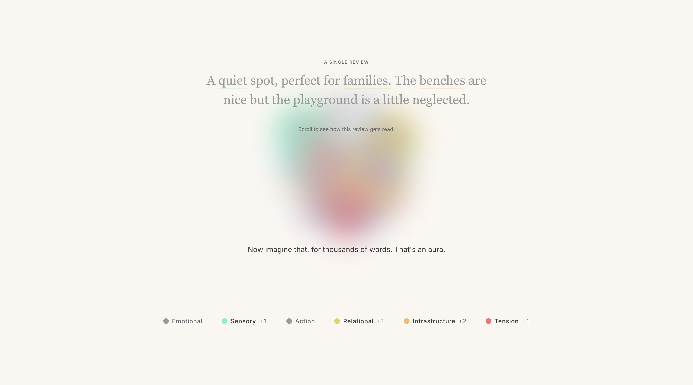
  <figcaption><strong>Beat 05 — Worked example (resolved).</strong> The aura completes: a colour-weighted portrait built entirely from citizen words.</figcaption>
</figure>

<figure class="gallery-fig">
  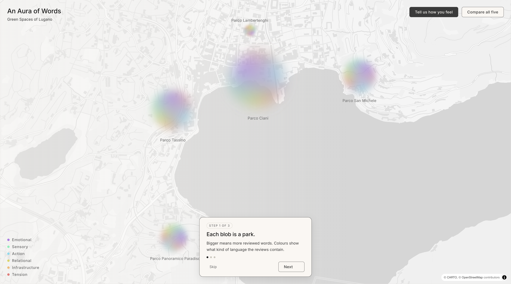
  <figcaption><strong>Beat 06 — Map.</strong> The five auras placed on Lugano's geography. Differences in size and colour weight are immediately legible.</figcaption>
</figure>

<figure class="gallery-fig">
  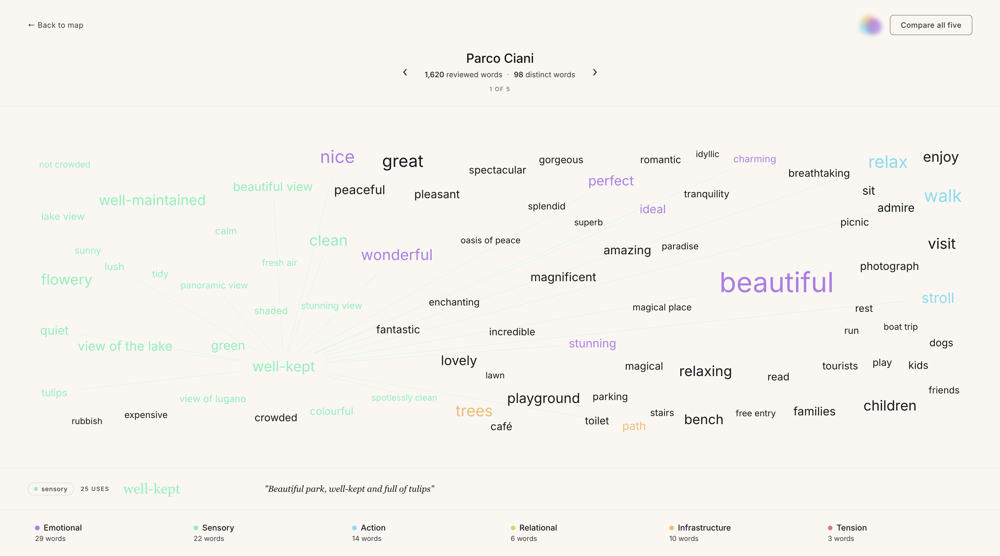
  <figcaption><strong>Park detail.</strong> Clicking a park reveals its full aura, word breakdown, and contribution prompt.</figcaption>
</figure>

### Phase 3 — Layout evaluations

Earlier composition studies for each park, from the Phase 3 design review.

<div class="gallery-grid">
  <figure class="gallery-thumb">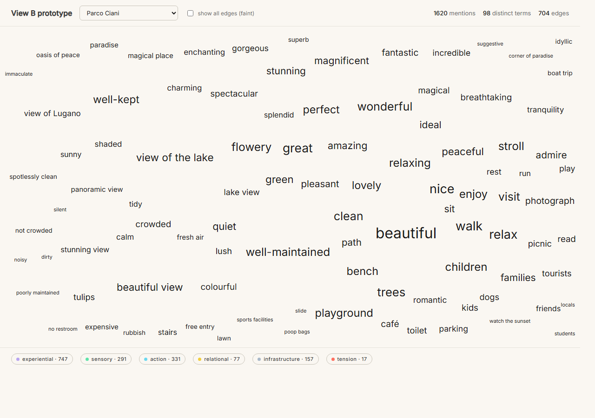<figcaption>Parco Ciani</figcaption></figure>
  <figure class="gallery-thumb">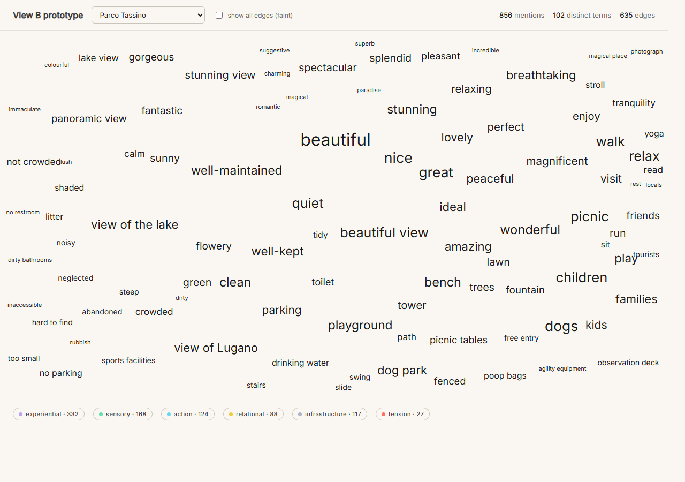<figcaption>Parco Tassino</figcaption></figure>
  <figure class="gallery-thumb">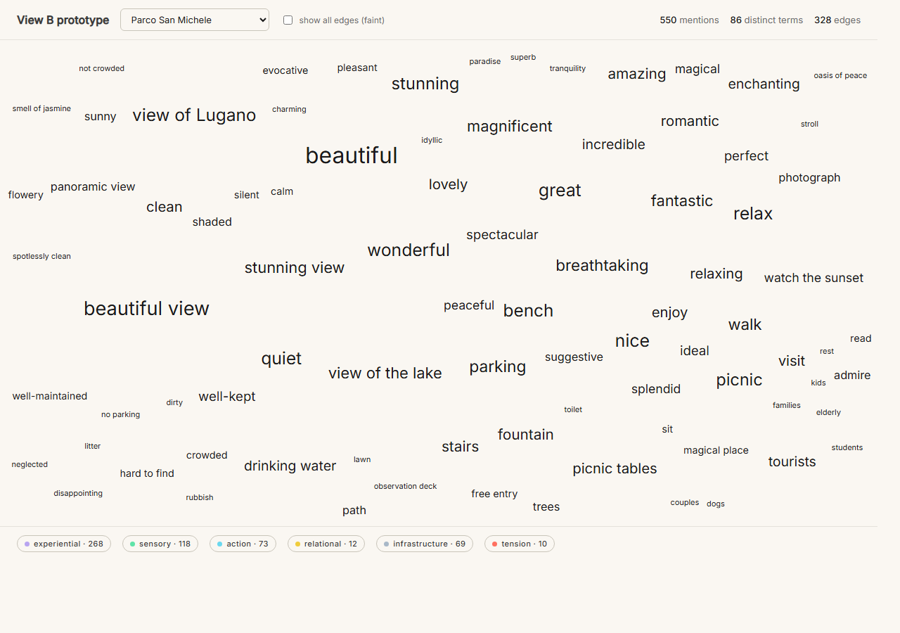<figcaption>San Michele</figcaption></figure>
  <figure class="gallery-thumb">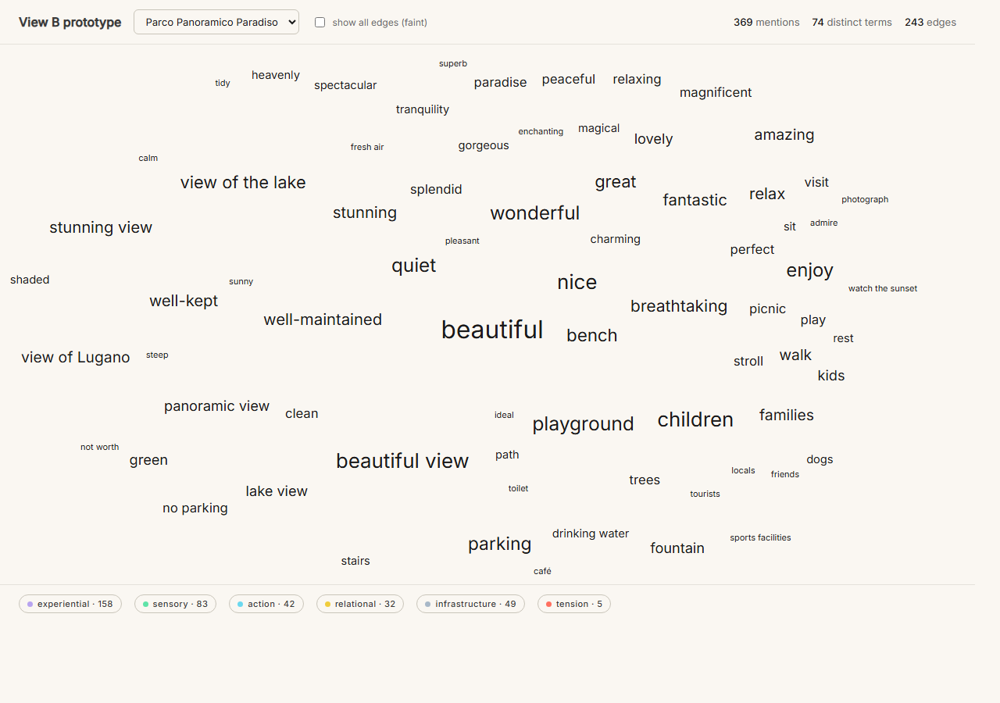<figcaption>Panoramico Paradiso</figcaption></figure>
  <figure class="gallery-thumb">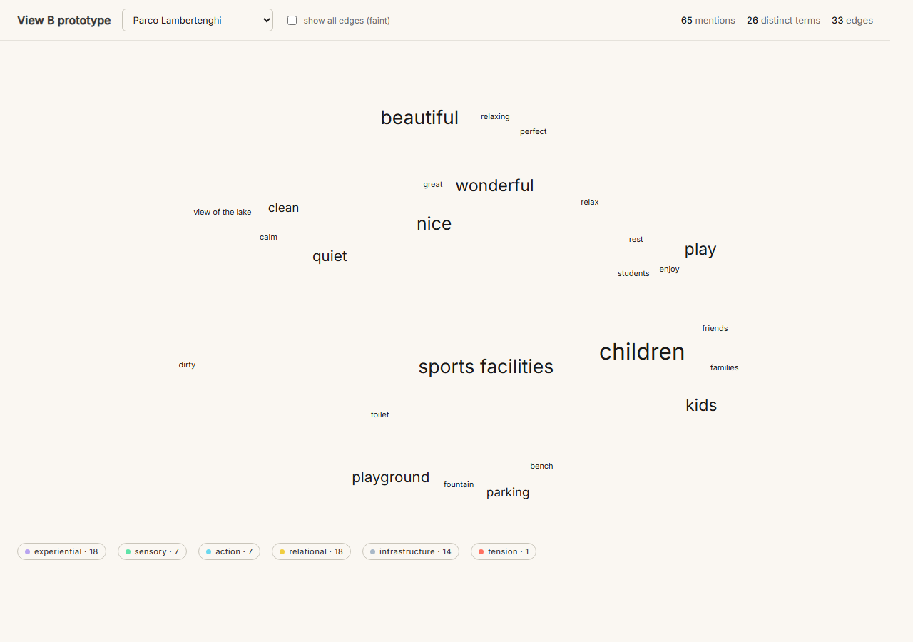<figcaption>Lambertenghi</figcaption></figure>
</div>

## Video Walkthrough

A 90–120 second guided traversal of the live demo: from opening hero, through the method explanation and the six lenses, to the worked example and the Lugano map.

<video controls preload="metadata" poster="./assets/img/06-map.png">
  <source src="./assets/video/walkthrough.mp4" type="video/mp4"/>
  Your browser does not support embedded video. <a href="./assets/video/walkthrough.mp4">Download the walkthrough (MP4)</a>.
</video>

> In print, the embedded video falls back to its poster frame. The full recording is in `docs/assets/video/walkthrough.mp4` and at the [live demo ↗](https://jerem-marti.github.io/MAInD-Making_Use_of_Data-2026-Lugano_Parks/).

## Credits / Colophon

**Author.** Jérémy Martin · jeremy_martin@bluewin.ch
**Course.** SUPSI MAIND-S2 — *Make Use of Data*, Master in Advanced Interaction Design, Semester 2
**Year.** 2026

**Data.** Google Maps reviews of five public parks in Lugano (Ciani, Tassino, San Michele, Panoramico Paradiso, Lambertenghi). Public review text. No personally identifying information is reproduced verbatim beyond fair-use snippets used as worked examples. Full processed dataset available as a [Google Sheet ↗](https://docs.google.com/spreadsheets/d/1rGs9NQ-b4_ZFAJvg3O0UtKvotzpYvXm4/edit?usp=sharing).

**Tools and libraries.**

- *Front-end*: React 18, TypeScript, Vite
- *Visualisation*: D3 (force, scale, selection), Three.js, MapLibre GL, custom Canvas
- *Data pipeline*: Python + Playwright (collection), TypeScript (preprocessing — `scripts/preprocess.ts`), XLSX → JSON
- *Validation*: Claude (semantic-category sanity check)
- *Typeface*: Inter — Rasmus Andersson, SIL Open Font License
- *Map tiles*: OpenStreetMap contributors via MapLibre

**Repository.** [github.com/jerem-marti/MAInD-Making_Use_of_Data-2026-Lugano_Parks](https://github.com/jerem-marti/MAInD-Making_Use_of_Data-2026-Lugano_Parks)
**Live demo.** [jerem-marti.github.io/MAInD-Making_Use_of_Data-2026-Lugano_Parks/](https://jerem-marti.github.io/MAInD-Making_Use_of_Data-2026-Lugano_Parks/)

<hr class="lens-rule"/>

<p class="colophon-end">Set in Inter. Composed in markdown, typeset for A4 print via a custom stylesheet that mirrors the project's design tokens.</p>
